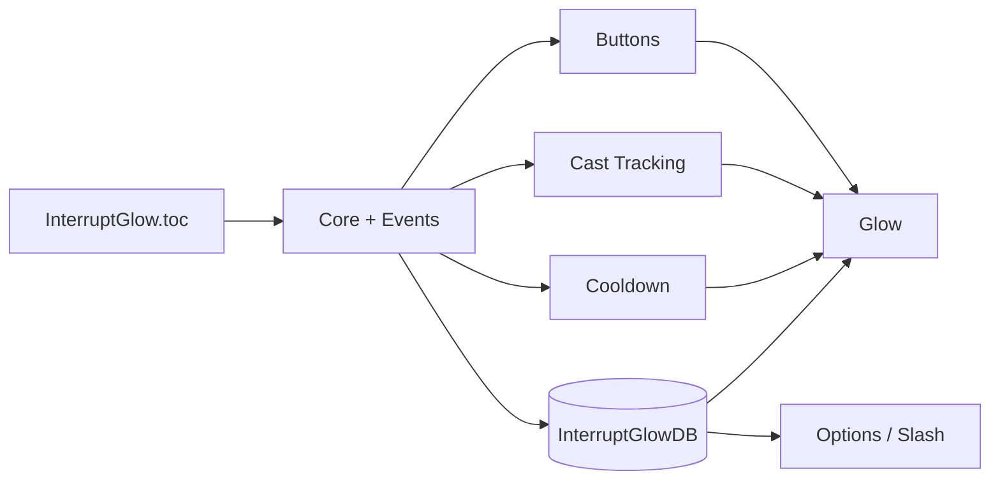

# Code graph

```mermaid
flowchart LR
  TOC["InterruptGlow.toc"] --> Core["Core + Events"]
  Core --> DB[("InterruptGlowDB")]
  Core --> Buttons["Buttons"]
  Core --> Cast["Cast Tracking"]
  Core --> CD["Cooldown"]
  Buttons --> Glow["Glow"]
  Cast --> Glow
  CD --> Glow
  DB --> Glow
  DB --> Options["Options / Slash"]
```
